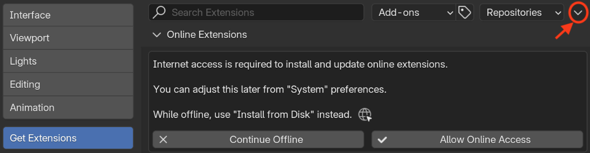

Installation
=====
Arcade was designed with a simple installation process in mind, requiring no prior Python knowledge or manual installation of dependencies by the user. The tool is packaged as a Blender add-on extension, making the installation process extremely straightforward.

Requirements
------------------
To get started, you only need to download three items (the forth item is optional):

- **Blender**: Donwload Blender `here <https://blender.org>`_ and install the software. Arcade has been tested with Blender v4.3.
- **Arcade**: Latest release of Arcade as ``.zip`` file. Arcade is compatible with Windows (x86) and macOS (ARM64).
- **Weather data**: A ``.epw`` file representing the climate conditions of the area of interest. Such files can be downloaded from the `EnergyPlus website <https://energyplus.net/weather>`_.
- **(Optional) Google API Key**: To enable the AI image recognition module (BRAILS), a valid Google API key is required. However, this is not strictly necessary for using Arcade, as the probabilistic method can be used as an alternative. 

.. important::

   As outlined in the `BRAILS <https://github.com/NHERI-SimCenter/BRAILS>`_ documentation, a Google API key is required to successfully run the image recognition model. Instructions on obtaining a Google API key can be found `here <https://developers.google.com/maps/documentation/embed/get-api-key>`_. BRAILS uses Maps Static API and Street View Static API to access satellite and street-level imagery. Ensure that both APIs are enabled when configuring your Google API key.

Steps
------------------
After downloading and installing the required items, launch Blender and go to **Edit > Preferences > Get Extensions**. Next, click the dropdown arrow in the top-right corner of the window to expand the menu, then select **Install from Disk...**

Next, select the Arcade ``.zip`` file to enable the add-on. The installation process may take a few minutes as Blender installs the necessary Python packages. During this time, Blender may become unresponsive.

Before using Arcade, you need to configure a few `settings <user.html>`_ in the Preferences panel.

