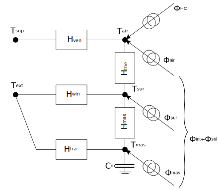

Energy model
=====

Each building is modeled as single thermal zone, represented by a lumped-capacity model based on a 5R1C thermal network. This simplified 5R1C model uses five thermal resistances and one thermal capacity to reproduce the transient thermal behaviour of buildings. 

The thermal zone is modeled with three temperature nodes, the indoor air temperature ``TAir``, the envelope internal surface temperature ``TSur`` and the zone's mass temperature ``TMas``, and two boundary condition nodes, supply air temperature ``TSup`` and the external air temperature ``TExt``. The five resistances are related to heat transfer by ventilation ``HVen``, windows ``HWin``, opaque components (split between ``HTra`` and ``HMas``) and heat transfer between the internal surfaces of walls and the air temperature ``HThe``. The thermal capacity ``Cm`` includes the thermal capacity of the entire zone. The heating and/or cooling demand is found by calculating the heating and/or cooling power ``ΦHC`` that needs to be supplied to, or extracted from, the internal air node to maintain a certain set-point. Internal, ``Φint`` , and solar, ``Φsol``, heat gains are input values, which are split in three components.

