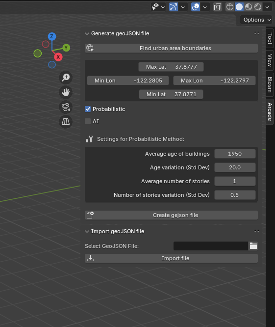

Basic tutorial
=====

First, delete the three default objects created by Blender at startup to ensure a clean scene. Next, press ``N`` to open Blender’s Sidebar. You should now see the Arcade panel in the Sidebar. Click on it to explore the various sub-panels, buttons, and settings available in Arcade.

The workflow can be divided in three steps:

- **Generate the geoJSON file**: Start by pressing the ``Create geoJSON file button``. This action prompts Arcade to generate a geoJSON file containing the building footprints of an urban area. The area is defined by a bounding box with four parameters: maximum latitude, maximum longitude, minimum latitude, and minimum longitude. By default, these parameters correspond to a small block in Berkeley, California.

- **Import the geoJSON file**: Next, select the generated geoJSON file by pressing the folder icon. You will find the geoJSON in the output folder that you chose in the Preferences panel. Once you click ``Import geoJSON file``, Arcade will create the buildings in the Blender scene!

- **Run energy simulations**: Finally, select all buildings in the scene, and press the ``Calculate Heating and Cooling Loads`` button. Arcade will run energy simulations and output a .csv file with hourly heating and cooling loads for each building.
